# Demos

**Status Tags:** 🟢 Good · 🟡 Debug Artifacts · 🟠 Needs Content · 🔴 Broken · 🔵 Visual Issue

---

- ### Blinn-Phong Lighting
  [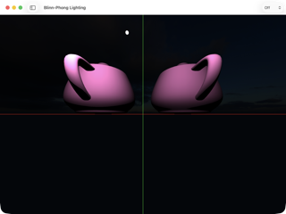](screenshots/BlinnPhongLighting.png)

  **Name:** Blinn-Phong Lighting
  **Description:** 3D lighting demonstration using the Blinn-Phong shading model with animated lights.
  **Suggested Short Description:** Blinn-Phong shaded teapot with an animated point light.
  **Suggested Long Description:** Renders a Utah teapot using the Blinn-Phong reflection model with ambient, diffuse, and specular components. A point light orbits the scene, showing how highlights and shadows shift in real time. The view is split into quadrants by colored crosshairs for debugging camera alignment.
  **Accessibility Label:** Two pink teapots viewed from above in a split-view layout divided by green vertical and red horizontal crosshairs. A small white point light is visible in the upper-left quadrant. The bottom half of the window is entirely black. A dark skybox is faintly visible behind the teapots.
  **Status:** 🔵 Visual Issue — bottom half of viewport is black; the scene doesn't fill the window. Crosshairs may not be intended for the default view.
  **Suggested Resolution:** Better default camera angle.

- ### Skybox
  

  **Name:** Skybox
  **Description:** Environment mapping demonstration using cube textures for 360-degree backgrounds.
  **Suggested Short Description:** Cubemap skybox with turntable camera control.
  **Suggested Long Description:** Displays a cube-mapped environment texture (a dusk/sunset sky) projected onto a skybox that surrounds the camera. Supports turntable rotation to look around the full 360° environment. Useful for testing environment maps and as a backdrop for other rendering demos.
  **Accessibility Label:** A sunset/dusk skybox cubemap showing pink and gray clouds. A black "-Z" axis label is rendered on the visible face. Dark blue bars are visible on the left and right edges where the skybox doesn't fill the window. Toolbar has Turntable and Off dropdown controls.
  **Status:** 🟡 Debug Artifacts — "-Z" face label is visible and should be hidden. Also a minor viewport fill issue with dark blue bars on the edges.
  **Suggested Resolution:** Better default camera angle. More exciting skybox. No debug artifacts (make them a toggle).

- ### Triangle
  

  **Name:** Triangle
  **Description:** Basic triangle rendering with animated colors and performance metrics.
  **Suggested Short Description:** Hello-world triangle with GPU timing overlay.
  **Suggested Long Description:** The simplest possible Metal rendering demo: a single full-screen triangle with animated vertex colors. An overlay displays real-time GPU and kernel execution times, making it useful as a baseline performance reference and a starting point for understanding the rendering pipeline.
  **Accessibility Label:** A large light-green triangle centered on a black background, extending slightly off the bottom edge. A semi-transparent gray overlay in the top-left corner shows "GPU Time 0.057333 ms" and "Kernel Time 0.088208 ms". Window title bar reads "Triangle".
  **Status:** 🟢 Good — clean and functional hello-world demo.
  **Suggested Resolution:** It's boring but it's a triangle.

- ### Compute
  

  **Name:** Compute
  **Description:** Simple compute shader that copies data between GPU buffers.
  **Suggested Short Description:** GPU buffer copy via compute shader.
  **Suggested Long Description:** Demonstrates the most basic compute shader operation: dispatching a kernel that copies data from one GPU buffer to another. Verifies the result on the CPU side and displays the outcome. Intended as a minimal example of the compute pipeline without any rendering.
  **Accessibility Label:** A blank white window with a single line of text centered vertically reading "Optional(Swift.Result<(), Swift.Error>.success())". No graphics or visual content. Window title bar reads "Compute".
  **Status:** 🔴 Broken — displays a raw Swift debug string instead of a proper UI. No visual demonstration of the compute operation.
  **Suggested Resolution:** No screenshot needed perhaps :-) But it is a demo we use - lets brainstorm how to sex it up

- ### Stencil Buffer
  [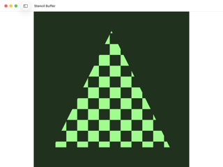](screenshots/StencilBuffer.png)

  **Name:** Stencil Buffer
  **Description:** Stencil buffer masking demonstration with checkerboard pattern clipping.
  **Suggested Short Description:** Checkerboard pattern clipped to a triangle via stencil test.
  **Suggested Long Description:** Renders a green checkerboard pattern that is clipped to a triangle shape using the stencil buffer. The stencil test discards fragments outside the triangle, producing a clean masked effect. A clear demonstration of how stencil operations work in Metal's render pipeline.
  **Accessibility Label:** A large triangle shape filled with a green and black checkerboard pattern on a dark green background. The checkerboard squares are evenly sized and the triangle edges are crisp. No UI controls visible. Window title bar reads "Stencil Buffer".
  **Status:** 🟢 Good — sharp, clean, and clearly demonstrates the stencil effect.
  **Suggested Resolution:** The triangle is boring lets use a better shape. Also the checker is a bit dull :-)

- ### LUT Color Grading
  [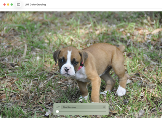](screenshots/LUTColorGrading.png)

  **Name:** LUT Color Grading
  **Description:** Color grading and correction using Look-Up Tables (LUTs) for cinematic effects.
  **Suggested Short Description:** Apply LUT color grades to a photo in real time.
  **Suggested Long Description:** Applies a 3D Look-Up Table (LUT) to a source image in real time using a compute or fragment shader. Includes a dropdown to select from multiple LUT presets (e.g., "Blue Bias") and a slider to blend between the original and graded image. Demonstrates a common post-processing technique used in film and game color pipelines.
  **Accessibility Label:** A photo of a brown and white boxer puppy standing on grass, with a subtle cool/blue color grade applied. A semi-transparent control panel at the bottom shows "LUT: Blue Bias.png" dropdown and an intensity slider set to minimum. Window title bar reads "LUT Color Grading".
  **Status:** 🟢 Good — nice interactive demo with a good default image.
  **Suggested Resolution:** Lets use a better LUT and have it 50%

- ### Game of Life
  

  **Name:** Game of Life
  **Description:** Conway's Game of Life cellular automaton simulation using GPU compute shaders.
  **Suggested Short Description:** GPU-driven Conway's Game of Life simulation.
  **Suggested Long Description:** Implements Conway's Game of Life as a GPU compute shader, updating a 2D grid of cells each frame according to the classic birth/death rules. The simulation runs entirely on the GPU, demonstrating parallel cellular automaton computation. Includes pause/play controls and a fill mode selector to seed the grid.
  **Accessibility Label:** A dense black and white cellular automaton grid in mid-simulation showing many small white cell clusters, gliders, oscillators, and still-life patterns against a black background. A semi-transparent control bar at the bottom center has a pause button and a "Fill" mode dropdown. Window title bar reads "Game of Life".
  **Status:** 🟢 Good — visually active and interesting. The screenshot captured a good mid-simulation state.
  **Suggested Resolution:** Good for me

- ### Debug Shaders
  [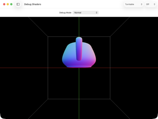](screenshots/DebugShaders.png)

  **Name:** Debug Shaders
  **Description:** Shader debugging visualization with various modes including normals, MS coordinates, depth, wireframe, and distance fields.
  **Suggested Short Description:** Visualize normals, depth, wireframe, and other shader debug modes.
  **Suggested Long Description:** Renders a teapot inside a wireframe room with selectable debug visualization modes. Each mode replaces the standard shading with a diagnostic output: surface normals mapped to RGB, model-space coordinates, linearized depth, wireframe overlay, or signed distance field visualization. Useful for diagnosing rendering issues and understanding shader inputs.
  **Accessibility Label:** A teapot rendered in normal-map false color (cyan top, magenta sides, blue-pink gradient) centered inside a white wireframe room on a black background. Green vertical and red horizontal crosshairs intersect at the center. Toolbar shows "Debug Mode: Normal" dropdown, Turntable dropdown, and Off dropdown. Window title bar reads "Debug Shaders".
  **Status:** 🟢 Good — clear visualization of normal-map debug mode. Good reference for shader debugging.
  **Suggested Resolution:** Sexier angle

- ### Point Cloud
  

  **Name:** Point Cloud
  **Description:** Interactive point cloud visualization with thousands of colored points arranged in a torus shape.
  **Suggested Short Description:** Rainbow point cloud torus with adjustable parameters.
  **Suggested Long Description:** Renders thousands of colored point primitives arranged on the surface of a torus. Points are colored by their angular position, producing a rainbow gradient around the ring. An interactive control panel lets you adjust point count (up to hundreds of thousands), point size, and the major/minor radii of the torus. Supports turntable camera rotation.
  **Accessibility Label:** A torus shape made of 25,000 small rainbow-colored dots (cycling through red, orange, yellow, green, cyan, blue, purple) on a black background. A semi-transparent control panel in the top-left shows sliders for Points (25,000), Point Size (5.0), Major Radius (2.0), Minor Radius (0.8) and a "Regenerate" button. Toolbar has Turntable and Off dropdowns.
  **Status:** 🟢 Good — vibrant and visually appealing with good interactive controls.
  **Suggested Resolution:** Sexier angle and demo - also reduce size of controls.

- ### Video Playback
  

  **Name:** Video Playback
  **Description:** Full screen video playback with streaming textures rendered through billboard pipeline.
  **Suggested Short Description:** Video texture streaming with retro VCR post-processing effects.
  **Suggested Long Description:** Streams video frames as textures onto a full-screen billboard rendered via Metal. Includes an extensive VCR-style post-processing effects panel with controls for curvature, tracking errors, scanlines, flicker, vignette, noise, color shift, and more — simulating analog video degradation. Requires loading a video file to display.
  **Accessibility Label:** A black rectangular video area in the upper portion of the window with no content playing. Below it, a play button, "Load Video" button, and "VCR Effects" checkbox (checked). An orange warning reads "No default video found. Click 'Load Video' to select one." The lower two-thirds of the window is filled with a "VCR Settings" panel containing 14 labeled sliders (Curvature, Tracking, Flicker, Scanlines, Vignette, Noise, Color Shift, etc.) and a "Set All to Zero" button.
  **Status:** 🟠 Needs Content — no default video bundled, so the screenshot shows an empty player with an error message. The VCR effects panel dominates the view.
  **Suggested Resolution:** Needs a video! reduce size of controls.

- ### 360° Panorama
  

  **Name:** 360° Panorama
  **Description:** Interactive 360-degree panoramic photo viewer with spherical projection and WorldView rotation.
  **Suggested Short Description:** Spherical panorama viewer with interactive rotation.
  **Suggested Long Description:** Projects an equirectangular panorama image onto a sphere (or other projection geometry) and lets the user look around by rotating the camera. Supports gamma correction and a model-space debug overlay. Requires importing a panoramic image to display.
  **Accessibility Label:** A blank white window with a centered warning triangle icon and bold "No File" text. The toolbar contains "Sphere" dropdown, "Show MS" button, "Gamma Correction" button, and "Import" dropdown menu. Window title bar reads "360° Panorama".
  **Status:** 🟠 Needs Content — no default panorama image bundled. Shows an empty "No File" placeholder.
  **Suggested Resolution:** Needs content.

- ### Wireframe Teapot
  [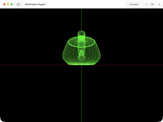](screenshots/WireframeTeapot.png)

  **Name:** Wireframe Teapot
  **Description:** Wireframe demo.
  **Suggested Short Description:** Wireframe-rendered Utah teapot.
  **Suggested Long Description:** Renders the classic Utah teapot as a wireframe mesh, showing the underlying triangle topology. The bright green wireframe on a black background gives a retro/technical aesthetic. Supports turntable rotation to inspect the mesh from all angles. Includes colored crosshairs for camera alignment reference.
  **Accessibility Label:** A bright green wireframe teapot centered in the upper half of a black window. Green vertical and red horizontal crosshairs extend across the full viewport. The lower half of the window is empty black space. Toolbar has Turntable and Off dropdowns. Window title bar reads "Wireframe Teapot".
  **Status:** 🟢 Good — classic wireframe look. Lots of empty space below the teapot but the teapot itself looks sharp.
  **Suggested Resolution:** better angle!

- ### Trivial Mesh
  

  **Name:** Trivial Mesh
  **Description:** Demonstration of procedurally generated geometric primitives (box, tetrahedron, octahedron) with Blinn-Phong lighting.
  **Suggested Short Description:** Gallery of procedural geometric primitives with Blinn-Phong lighting.
  **Suggested Long Description:** Renders a collection of procedurally generated geometric primitives — pyramids, spheres, tetrahedra, boxes, cylinders, octahedra, and more — each with distinct colors and Blinn-Phong shading. Demonstrates the mesh generation API and basic lighting applied to simple shapes. Includes a wireframe toggle and turntable camera control.
  **Accessibility Label:** A horizontal row of small colorful 3D shapes (gray pyramid, olive sphere, dark teal pyramid, red tetrahedron, navy blue shape, bright magenta box, yellow cylinder, purple octahedron, pink sphere, white pyramid) arranged along the center of the window against a dark skybox. A "Wireframe" toggle is in the top-left. Toolbar has Turntable and Off dropdowns. Green vertical and red horizontal crosshairs visible.
  **Status:** 🔵 Visual Issue — shapes are small and in a single row at the center of the frame. Camera is too far away and the arrangement is flat. Could use a grid layout or closer camera.
  **Suggested Resolution:** better angle!

- ### Scene Graph
  

  **Name:** Scene Graph
  **Description:** Scene graph traversal demo showing stacked row/column transforms rendered as a 4×4 grid.
  **Suggested Short Description:** Hierarchical scene graph with nested transforms and varied primitives.
  **Suggested Long Description:** Demonstrates a scene graph data structure where child nodes inherit parent transforms. Renders a collection of primitives (box, sphere, cone, diamond, capsule) arranged through hierarchical row/column layout nodes. Shows how nested translation, rotation, and scale transforms compose to position objects in the scene.
  **Accessibility Label:** A horizontal row of 3D primitives on a black background: a large mauve/pink box on the left, followed by a bright white/pink sphere, a small white cube, a beige cone, a metallic diamond shape, and a pink capsule on the right. All objects have a pink/warm lighting. Toolbar has Turntable and Off dropdowns. Window title bar reads "Scene Graph".
  **Status:** 🔵 Visual Issue — described as a 4×4 grid but renders as a single row. Description appears outdated. Objects are clustered in the center with lots of empty space.
  **Suggested Resolution:**  better angle

- ### GraphicsContext3D
  

  **Name:** GraphicsContext3D
  **Description:** SwiftUI.Canvas-style API for rendering 3D geometry with Path3D and stroke/fill operations.
  **Suggested Short Description:** Canvas-style 3D drawing API with Path3D strokes.
  **Suggested Long Description:** Provides a SwiftUI Canvas-like API for immediate-mode 3D rendering. Uses Path3D to define 3D geometry and supports stroke and fill operations. The demo shows simple 3D shapes drawn using this high-level API, demonstrating that complex Metal rendering can be expressed with familiar SwiftUI-style drawing calls.
  **Accessibility Label:** Three horizontal rounded rectangles/bars stacked vertically in the center of a black window: white on top, orange in the middle, blue on the bottom. Each bar is roughly the same width. The title bar is truncated to "GraphicsContext..." with a ">>" overflow button in the toolbar. Window title bar reads "GraphicsContext3D" (truncated).
  **Status:** 🔵 Visual Issue — very minimal visual output. Three flat bars don't showcase the 3D path capabilities well. Title is truncated in the window title bar. Needs a more compelling demo scene.
  **Suggested Resolution:** need to consider deprecating this - for now leave it in

- ### MetalCanvas
  

  **Name:** MetalCanvas
  **Description:** 2D Canvas-style API for rendering SwiftUI Paths with stroke operations using mesh shaders.
  **Suggested Short Description:** 2D path stroking via mesh shaders with configurable line width.
  **Suggested Long Description:** Renders SwiftUI Path objects as stroked lines using Metal mesh shaders instead of the CPU rasterizer. Supports multiple demo scenes including random lines, and allows adjusting line width interactively. Demonstrates how mesh shaders can efficiently generate line geometry on the GPU from high-level path descriptions.
  **Accessibility Label:** A dense web of hundreds of thin white lines crossing at random angles on a black background, filling most of the viewport. "Random Lines" is selected in a dropdown in the top-right toolbar. At the bottom, "Line Width: 2.0" label with a blue slider. Window title bar reads "MetalCanvas".
  **Status:** 🟢 Good — visually dense and demonstrates the line rendering capability well.
  **Suggested Resolution:** deprecate too. leave in for now - need a bigger plan for this.

- ### Hello Imageblock
  [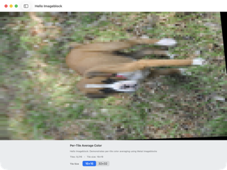](screenshots/HelloImageblock.png)

  **Name:** Hello Imageblock
  **Description:** The simplest imageblock demo: computes per-tile average color creating a pixelated/mosaic effect.
  **Suggested Short Description:** Per-tile color averaging using Metal imageblocks for a mosaic effect.
  **Suggested Long Description:** Demonstrates Metal imageblock (tile memory) usage by computing the average color for each tile and writing it back, creating a pixelated mosaic effect. The tile size is configurable (16×16 or 32×32), and stats show the number of tiles processed. Uses the same puppy test image as other image-processing demos for easy comparison.
  **Accessibility Label:** A photo of a boxer puppy on grass, heavily pixelated into a 16×16 mosaic grid. The puppy is still recognizable but blocky. Below the image, a panel reads "Per-Tile Average Color", "Hello Imageblock: Demonstrates per-tile color averaging using Metal imageblocks", "Tiles: 9,216 · Tile size: 16×16", and a "Tile Size" toggle with "16×16" selected and "32×32" as the other option.
  **Status:** 🟢 Good — clearly demonstrates the imageblock mosaic effect with informative stats.
  **Suggested Resolution:** Not sure why it's rotated :-)

- ### Offscreen Rendering
  [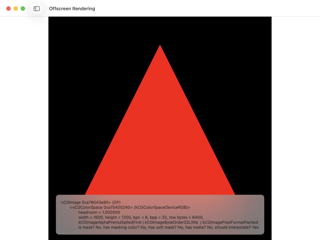](screenshots/OffscreenRendering.png)

  **Name:** Offscreen Rendering
  **Description:** Render-to-texture demonstration showing offscreen rendering capabilities.
  **Suggested Short Description:** Render a triangle offscreen and display the resulting CGImage.
  **Suggested Long Description:** Renders a simple red triangle to an offscreen Metal texture (not directly to the screen), then reads the result back as a CGImage and displays it in a SwiftUI Image view. Demonstrates the full offscreen rendering pipeline: creating a texture, rendering to it, and extracting the pixel data for CPU-side use.
  **Accessibility Label:** A large red triangle on a black background, displayed as a rasterized image (not a live Metal view). Below the image, a semi-transparent overlay shows raw CGImage debug information: memory address, color space (kCGColorSpaceDeviceRGB), headroom, dimensions (1600×1200), bits per component (8), bits per pixel (32), and row bytes. Window title bar reads "Offscreen Rendering".
  **Status:** 🟡 Debug Artifacts — raw CGImage description text (memory address, pixel format details) is displayed over the image. Should be cleaned up or hidden behind a debug toggle.
  **Suggested Resolution:** yeah lets tone down the debug info - needs white sidebars. Ugh

- ### MetalFX Upscaling
  [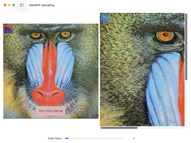](screenshots/MetalFXUpscaling.png)

  **Name:** MetalFX Upscaling
  **Description:** Image upscaling using MetalFX spatial upsampling for enhanced image quality.
  **Suggested Short Description:** Side-by-side comparison of MetalFX spatial upscaling.
  **Suggested Long Description:** Uses Apple's MetalFX framework to spatially upscale a low-resolution source image. Shows the original image alongside a zoomed/upscaled version for quality comparison. A scale factor slider controls the upscaling ratio. Uses the classic mandrill test image to make quality differences easy to evaluate.
  **Accessibility Label:** Two images side by side: on the left, a 512×512 mandrill (baboon) face test image showing the full face with a "512 x 512 / 256 kB" label. On the right, a zoomed-in crop of the upscaled version showing detail around the eye and blue nose ridge. A scrollbar is visible on the right image. At the bottom, "Scale Factor" slider set to 2. A small purple "M" watermark icon appears in the top-left corners of both images.
  **Status:** 🟢 Good — clear side-by-side comparison layout that effectively shows upscaling quality.
  **Suggested Resolution:** yeah but not a great representation - need something more dramatic or that better illustrates. we only get 1/2 the upscaled mandril

- ### Hit Test Demo
  [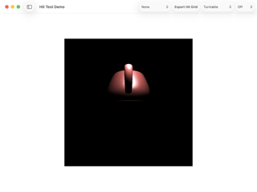](screenshots/HitTestDemo.png)

  **Name:** Hit Test Demo
  **Description:** Teapot rendering with hit test pipeline that outputs geometry ID, instance ID, triangle ID, depth, and barycentric coordinates.
  **Suggested Short Description:** GPU hit testing with per-pixel geometry and triangle ID readback.
  **Suggested Long Description:** Renders a teapot with a secondary hit-test render pass that writes geometry ID, instance ID, triangle ID, depth, and barycentric coordinates to auxiliary textures. Clicking on the rendered scene reads back these values, enabling precise GPU-side object picking. Includes an "Export Hit Grid" function and selectable display modes for visualizing the hit-test data.
  **Accessibility Label:** A small dark reddish-brown teapot centered in a black rectangular viewport that is noticeably smaller than the window, surrounded by white/gray empty space. Toolbar contains a "None" dropdown, "Export Hit Grid" button, "Turntable" dropdown, and "Off" dropdown. Window title bar reads "Hit Test Demo".
  **Status:** 🔵 Visual Issue — the Metal viewport doesn't fill the window, leaving large gray margins. Teapot is small and dark, hard to see against the black background.
  **Suggested Resolution:** better angle

- ### Depth Buffer
  [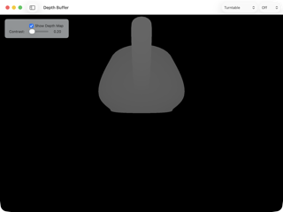](screenshots/DepthBuffer.png)

  **Name:** Depth Buffer
  **Description:** Demonstrates rendering depth buffer to texture. It also shows how to use customisable private functions.
  **Suggested Short Description:** Depth buffer visualization with adjustable contrast.
  **Suggested Long Description:** Renders a teapot and captures the depth buffer as a texture, then displays it as a grayscale image where brighter pixels are closer to the camera. A contrast slider controls the depth visualization range, and a checkbox toggles between the color render and the depth map view. Also demonstrates Metal's customizable private functions for shader composition.
  **Accessibility Label:** A grayscale teapot silhouette (lighter gray body against black background) showing depth values — closer surfaces are lighter. A semi-transparent control panel in the top-left has a checked "Show Depth Map" checkbox and a "Contrast: 0.20" slider. Toolbar has Turntable and Off dropdowns. Window title bar reads "Depth Buffer".
  **Status:** 🟢 Good — clean depth visualization that clearly shows the concept.
  **Suggested Resolution:** better angle user different mode/depth slider value

- ### Mixed Techniques
  [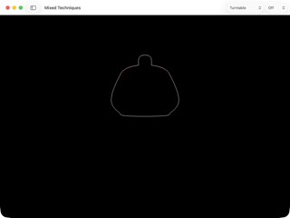](screenshots/MixedTechniques.png)

  **Name:** Mixed Techniques
  **Description:** Combination of multiple rendering techniques including lighting and animation.
  **Suggested Short Description:** Multi-technique rendering combining lighting, outlines, and animation.
  **Suggested Long Description:** Intended to demonstrate combining multiple rendering techniques in a single scene — including Blinn-Phong lighting, edge detection/silhouette outlines, and animated transforms. Should showcase how different render passes can be composed together for complex visual effects.
  **Accessibility Label:** A very faint, thin white outline of a teapot silhouette centered on a completely black background. The outline is barely visible — only the contour edges of the teapot body and lid are drawn. No lighting, color, or fill is visible. Toolbar has Turntable and Off dropdowns. Window title bar reads "Mixed Techniques".
  **Status:** 🔴 Broken — only a barely-visible silhouette outline renders. The "mixed techniques" (lighting, color, animation) appear to be missing or non-functional.
  **Suggested Resolution:** needs a few frames of animation before taking screenshot - needs better angle

- ### Bouncing Teapots
  

  **Name:** Bouncing Teapots
  **Description:** Physics simulation of animated teapots with MetalFX upscaling and instanced rendering.
  **Suggested Short Description:** Physics-driven teapots bouncing in a checkerboard room with instanced rendering.
  **Suggested Long Description:** Simulates dozens of colorful teapots bouncing and colliding inside a room with checkerboard-textured walls and a large central sphere obstacle. Uses instanced rendering to efficiently draw many teapot copies with different colors and transforms. Integrates MetalFX upscaling for performance. One of the most visually complex demos, combining physics, instancing, environment textures, and post-processing.
  **Accessibility Label:** Dozens of small colorful teapots (green, blue, teal, purple, brown, magenta, olive, pink) scattered across the scene, some mid-bounce, inside a room with black and white checkerboard walls, floor, and ceiling. A large dark sphere sits at the center. The checkerboard pattern shows perspective distortion. Toolbar has Turntable and Off dropdowns. Window title bar reads "Bouncing Teapots".
  **Status:** 🟢 Good — visually rich and dynamic. One of the most impressive demos.
  **Suggested Resolution:** better angle

- ### Apple Event Logo
  

  **Name:** Apple Event Logo
  **Description:** *(none)*
  **Suggested Short Description:** Procedural Apple logo with metallic shader effects.
  **Suggested Long Description:** Renders the Apple logo shape with a procedural metallic/glowing shader effect inspired by Apple event invitation artwork. The logo features a gold-to-dark-blue gradient with an inner glow that responds to mouse position. Demonstrates SDF-based shape rendering with artistic post-processing.
  **Accessibility Label:** The Apple logo rendered with a dark blue body and golden/amber glowing edges against a black background, displayed in a centered square viewport. Below the image, gray text reads "Mouse: (0.00, 0.00)". The rest of the window is white/light gray. Window title bar reads "Apple Event Logo".
  **Status:** 🟡 Debug Artifacts — "Mouse: (0.00, 0.00)" debug text is visible below the image and should be hidden.
  **Suggested Resolution:** remove debug info, white sidebars

- ### SDF Raymarching
  [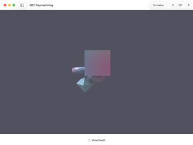](screenshots/SDFRaymarching.png)

  **Name:** SDF Raymarching
  **Description:** Real-time signed distance field raymarching with animated shapes, smooth blending, and dynamic lighting.
  **Suggested Short Description:** Raymarched SDF primitives with smooth blending and shadows.
  **Suggested Long Description:** Implements a full SDF raymarcher on the GPU, rendering primitive shapes (boxes, spheres, capsules) defined as signed distance functions. Supports smooth blending (smooth union/subtraction) between shapes, soft shadows, and animated transforms. A "Show Depth" toggle visualizes the ray depth buffer. Demonstrates a powerful screen-space rendering technique that doesn't use traditional triangle geometry.
  **Accessibility Label:** A medium gray background with three SDF shapes: a large semi-transparent pink/mauve rounded box in the center-right, a small metallic purple capsule to its left, and a teal/cyan diamond/octahedron shape below-left. Shadows are visible where shapes overlap. An unchecked "Show Depth" checkbox is at the bottom center. Toolbar has Turntable and Off dropdowns. Window title bar reads "SDF Raymarching".
  **Status:** 🔵 Visual Issue — the shapes look muted and small against the flat gray background. Could benefit from a more dramatic camera angle, better lighting, or more interesting default shape arrangement.
  **Suggested Resolution:** yeah change background color

- ### Particle Effects
  

  **Name:** Particle Effects
  **Description:** GPU-accelerated particle system with compute shaders featuring various emitter types like fountains, explosions, and fireworks.
  **Suggested Short Description:** GPU particle system with multiple emitter presets.
  **Suggested Long Description:** Runs a particle simulation entirely on the GPU using compute shaders. Each frame, a compute kernel updates particle positions, velocities, and lifetimes, while a render pass draws them as colored point sprites. Supports multiple emitter types (Magic Portal, Fountain, Explosion, Fireworks) with adjustable parameters for particle count, size, gravity, and emission rate. Includes a screenshot capture button.
  **Accessibility Label:** Thousands of small golden/amber glowing particles arranged in a loose ring/portal formation against a black background, with some particles scattered outward. A semi-transparent control panel in the top-left shows "Particle Effects Demo", "Emitter: Magic Portal" dropdown, sliders for Particles (5,000), Size (20.0), Gravity (-2.0), Emission (2,000/s), and a "Reset" button. Toolbar has "Screenshot" button, Turntable and Off dropdowns.
  **Status:** 🟢 Good — atmospheric particle ring effect with good interactive controls.
  **Suggested Resolution:** reduce control sizes

- ### glTF Model Viewer
  [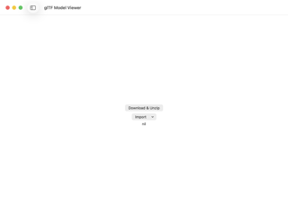](screenshots/GLTFModelViewer.png)

  **Name:** glTF Model Viewer
  **Description:** TODO
  **Suggested Short Description:** Load and render glTF 3D models.
  **Suggested Long Description:** Loads glTF model files (downloaded or imported) and renders them using the MetalSprockets pipeline. Supports downloading sample models from a remote repository and importing local .gltf/.glb files. Intended to demonstrate the glTF loading and rendering capabilities of the framework.
  **Accessibility Label:** A blank white window with three centered elements: a "Download & Unzip" button, an "Import" dropdown button below it, and the text "nil" in small gray type below that. No 3D content is displayed. Window title bar reads "glTF Model Viewer".
  **Status:** 🟠🟡 Needs Content / Debug Artifacts — no default model loaded, shows empty state. The "nil" text is a bug (likely a nil model description being printed).
  **Suggested Resolution:** use a default model

- ### Grass Sphere
  [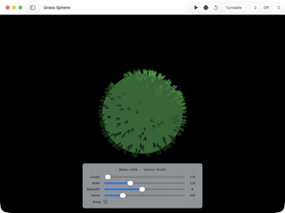](screenshots/GrassSphere.png)

  **Name:** Grass Sphere
  **Description:** Procedural grass rendering on a sphere using Object and Mesh shaders with uniform point distribution.
  **Suggested Short Description:** Mesh shader grass blades growing from a sphere surface.
  **Suggested Long Description:** Uses Metal Object and Mesh shaders to procedurally generate grass blade geometry on the GPU. Points are distributed uniformly on a sphere surface, and each point spawns multiple grass blades. The mesh shader generates all blade triangles without any CPU-side geometry — demonstrating how mesh shaders can replace traditional vertex/geometry shader pipelines for procedural content. Parameters for blade length, width, count per point, and total points are adjustable in real time.
  **Accessibility Label:** A green sphere covered in procedural grass blades viewed from slightly above, centered on a black background. The grass is short and dense, with darker patches where blades cast shadows on each other. Below the sphere, a control panel shows "Blades: 4,000 · Vertices: 40,000" with sliders for Length (0.15), Width (1.00), Blades/Pt (8), Points (500), and a Droop checkbox. Toolbar has play/record/reset buttons, Turntable and Off dropdowns.
  **Status:** 🟢 Good — impressive mesh shader demo with clear stats and controls.
  **Suggested Resolution:** reduce control size

- ### Spiral Particles
  

  **Name:** Spiral Particles
  **Description:** Particle system where each particle generates a colorful spiral of triangles using Object and Mesh shaders with parallel thread execution.
  **Suggested Short Description:** Mesh shader spirals of colorful triangles orbiting in 3D.
  **Suggested Long Description:** Each particle emits a spiral trail of triangles generated entirely by Object and Mesh shaders on the GPU. The spirals orbit and rotate in 3D space with configurable speed, orbit radius, and triangle count. Demonstrates mesh shader amplification where a small number of input objects produce a large amount of output geometry through parallel thread execution.
  **Accessibility Label:** Eight small clusters of colorful rainbow-tinted triangles (pink, yellow, green, cyan, blue) scattered across a black background, each forming a loose spiral pattern. A semi-transparent control panel in the top-left shows "Spiral Particles", "Each particle generates a spiral using mesh shaders", "Particles: 8 · Triangles: 240 · Vertices: 720", with sliders for Particles (8), Triangles (30), Speed (1.00), Orbit (3.00), Size (0.50). Toolbar has a reset button, Turntable and Off dropdowns.
  **Status:** 🟢 Good — but the spirals are small with only 8 particles. Would look more impressive with higher default particle count.
  **Suggested Resolution:** reduce control size - add more things

- ### Tiled SDF (2D)
  [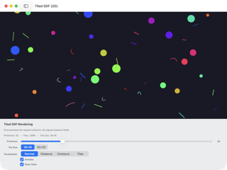](screenshots/TiledSDF2D.png)

  **Name:** Tiled SDF (2D)
  **Description:** Demonstrates tile-based culling for 2D signed distance fields. Primitives are culled to tiles and stored in threadgroup memory, reducing global memory access per pixel.
  **Suggested Short Description:** Tile-culled 2D SDF rendering with animated primitives.
  **Suggested Long Description:** Renders animated 2D signed distance field primitives (circles, line segments, arcs) using a tile-based culling approach. Each screen tile determines which primitives overlap it and stores them in threadgroup memory, so each pixel only evaluates nearby primitives rather than the full set. Supports multiple visualization modes (normal rendering, distance field, contours, tile heat map) and adjustable primitive count and tile size. Demonstrates an efficient GPU compute technique for rendering large numbers of 2D SDF shapes.
  **Accessibility Label:** A dark navy/purple background filled with ~50 colorful animated 2D shapes: solid circles (blue, green, yellow, red, pink, magenta, orange), short line segments, and small arcs in various bright colors, scattered across the viewport. Below the rendering area, a control panel shows "Tiled SDF Rendering" with description text, "Primitives: 50 · Tiles: 7,680 · Tile size: 16×16", a Primitives slider, Tile Size toggle (16×16 / 32×32), Visualization mode picker (Normal / Distance / Contours / Tiles), and Animate and Show Stats checkboxes (both checked).
  **Status:** 🟢 Good — one of the most polished demos with rich controls and clear visualization.
  **Suggested Resolution:** reduce the controls

- ### Voxel Renderer
  [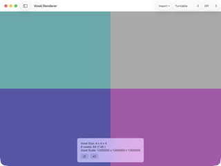](screenshots/VoxelRenderer.png)

  **Name:** Voxel Renderer
  **Description:** *(none)*
  **Suggested Short Description:** Voxel grid renderer with import and scale controls.
  **Suggested Long Description:** Renders a 3D voxel grid where each voxel is a colored cube. Supports importing voxel data from external files and scaling the grid resolution up or down. Demonstrates volumetric rendering of discrete 3D data using instanced or procedural cube geometry.
  **Accessibility Label:** Four large colored quadrants filling the viewport: teal/turquoise (top-left), gray (top-right), dark purple/indigo (bottom-left), and magenta/pink (bottom-right). A semi-transparent info panel at the bottom center shows "Voxel Size: 4 x 4 x 4", "# voxels: 64 (1 kB)", "Voxel Scale: 1.000000 x 1.000000 x 1.000000", with "/2" and "x2" scale buttons. Toolbar has "Import" dropdown, Turntable and Off dropdowns. Window title bar reads "Voxel Renderer".
  **Status:** 🔵 Visual Issue — the default 4×4×4 dataset is too coarse; it looks like a color test pattern rather than a voxel scene. Needs a more interesting default dataset to demonstrate voxel rendering.
  **Suggested Resolution:** start at higher resolution

- ### PBR Rendering
  [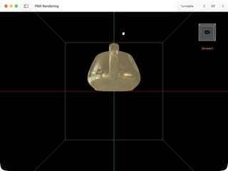](screenshots/PBRRendering.png)

  **Name:** PBR Rendering
  **Description:** Physically Based Rendering with multiple material presets, environment reflections, and animated lighting.
  **Suggested Short Description:** PBR metallic teapot with environment reflections.
  **Suggested Long Description:** Implements a physically based rendering pipeline with metallic/roughness material parameters, image-based lighting from an environment cubemap, and animated point lights. The teapot shows specular environment reflections on its surface. Multiple material presets allow switching between different metallic, rough, and dielectric appearances. Currently labeled as broken in the UI.
  **Accessibility Label:** A golden/brass metallic teapot with visible environment reflections on its surface, centered inside a wireframe room on a black background. Green vertical and red horizontal crosshairs intersect at center. A small white light dot is above the teapot. In the top-right corner, a small 3D orientation cube widget labeled "+Z" with orange "(broken)" text below it. Toolbar has Turntable and Off dropdowns. Window title bar reads "PBR Rendering".
  **Status:** 🔴 Broken — the demo self-labels as "(broken)" in the UI. The teapot renders with reflections but something is known to be wrong with the PBR implementation.
  **Suggested Resolution:** the broken part is the widget - the rendering is fine - better angle

- ### Color Adjust
  

  **Name:** Color Adjust
  **Description:** Color adjustment using compute shaders.
  **Suggested Short Description:** Real-time color adjustments via GPU compute shaders.
  **Suggested Long Description:** Applies color adjustment functions (gamma correction and potentially others) to a source image in real time using compute shaders. A function picker selects the adjustment type, and a slider controls the parameter value. Uses the same puppy test image as the LUT and Imageblock demos for consistent comparison across image-processing examples.
  **Accessibility Label:** A photo of a brown and white boxer puppy standing on grass with a warm/slightly darkened color tone from gamma correction. A semi-transparent control panel in the upper-right shows "Function: Gamma" dropdown and "Gamma: 2.20" slider with a blue track. The image fills the full viewport. Window title bar reads "Color Adjust".
  **Status:** 🟢 Good — clean and functional with clear controls.
  **Suggested Resolution:** better defaults.
