# MetalSprockets Examples

A companion collection of examples and demos for [MetalSprockets](https://github.com/schwa/MetalSprockets).

<!-- BEGIN:DEMOS -->
## Examples

### Basic

| Example | Description | Screenshot |
|---------|-------------|------------|
| **Blinn-Phong** | Blinn-Phong lit teapots with skybox | [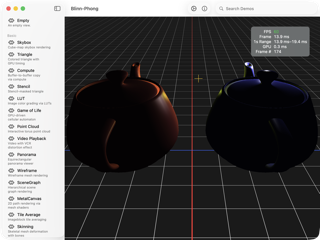](Documentation/screenshots/BlinnPhong.png) |
| **Skybox** | Cube-map skybox rendering | [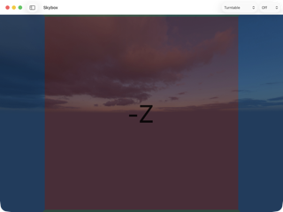](Documentation/screenshots/Skybox.png) |
| **Triangle** | Colored triangle with GPU timing | [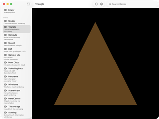](Documentation/screenshots/Triangle.png) |
| **Compute** | Buffer-to-buffer copy via compute | [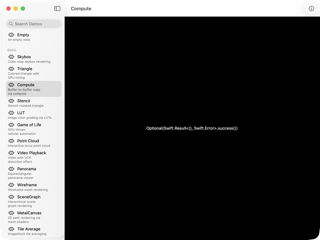](Documentation/screenshots/Compute.png) |
| **Stencil** | Stencil-masked triangle | [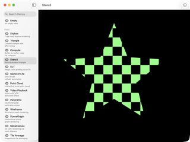](Documentation/screenshots/Stencil.png) |
| **LUT** | Image color grading via LUTs | [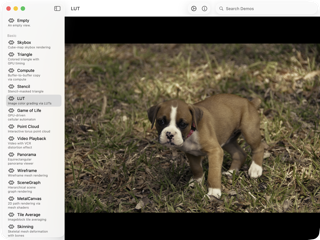](Documentation/screenshots/LUT.png) |
| **Game of Life** | GPU-driven cellular automaton | [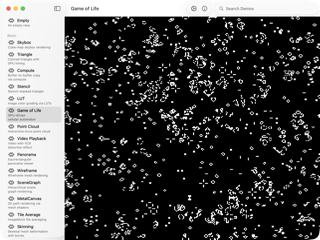](Documentation/screenshots/GameOfLife.png) |
| **Debug Shader** | Shader debug visualizations | [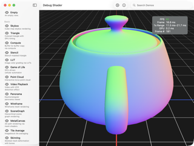](Documentation/screenshots/DebugShader.png) |
| **Point Cloud** | Interactive torus point cloud | [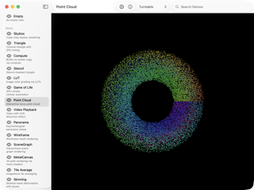](Documentation/screenshots/PointCloud.png) |
| **Video Playback** | Video with VCR distortion effect | [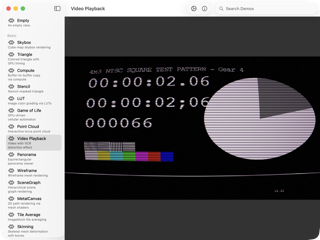](Documentation/screenshots/VideoPlayback.png) |
| **Panorama** | Equirectangular panorama viewer | [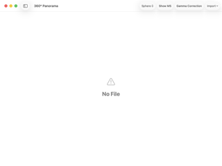](Documentation/screenshots/Panorama.png) |
| **Wireframe** | Wireframe mesh rendering | [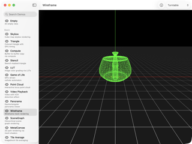](Documentation/screenshots/Wireframe.png) |
| **Trivial Mesh** | Procedural geometry primitives | [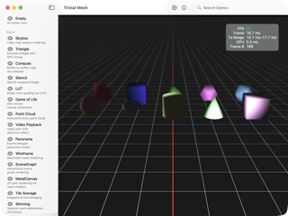](Documentation/screenshots/TrivialMesh.png) |
| **SceneGraph** | Hierarchical scene graph rendering | [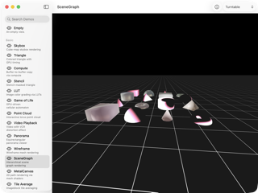](Documentation/screenshots/SceneGraph.png) |
| **GraphicsContext3D** | Canvas-style 3D path drawing | [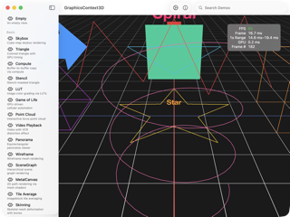](Documentation/screenshots/GraphicsContext3D.png) |
| **MetalCanvas** | 2D path rendering via mesh shaders | [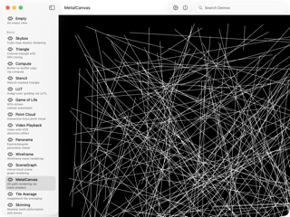](Documentation/screenshots/MetalCanvas.png) |
| **Tile Average** | Imageblock tile averaging | [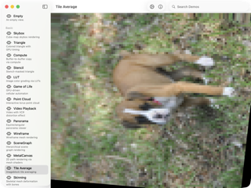](Documentation/screenshots/TileAverage.png) |
| **Offscreen *(macOS only)*** | Render to CGImage | [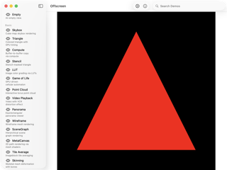](Documentation/screenshots/Offscreen.png) |
| **MetalFX *(macOS only)*** | MetalFX spatial upscaling | [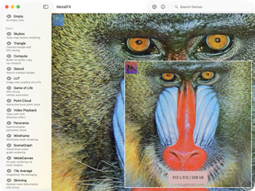](Documentation/screenshots/MetalFX.png) |
| **Skinning** | Skeletal mesh deformation with bones | — |

### Complex

| Example | Description | Screenshot |
|---------|-------------|------------|
| **Hit Test** | GPU-based object picking | [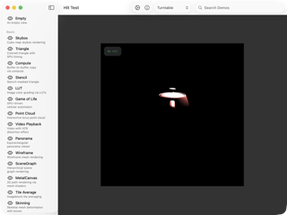](Documentation/screenshots/HitTest.png) |
| **Depth** | Depth buffer visualization | [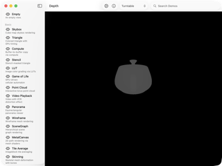](Documentation/screenshots/Depth.png) |
| **Mixed** | Combined render and compute passes | [](Documentation/screenshots/Mixed.png) |
| **Bouncing Teapots** | Physics-driven instanced teapots | [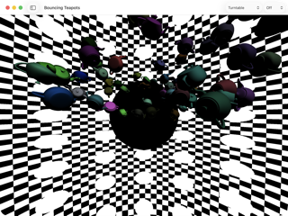](Documentation/screenshots/BouncingTeapots.png) |
| **Apple Event Logo** | Thermal-style video effect | [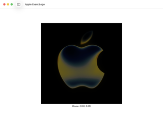](Documentation/screenshots/AppleEventLogo.png) |
| **PBR** | Physically based rendering | [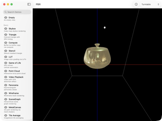](Documentation/screenshots/PBR.png) |
| **SDF** | 3D SDF raymarching | [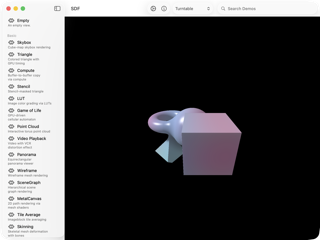](Documentation/screenshots/SDF.png) |
| **Particle Effects** | GPU compute particle system | [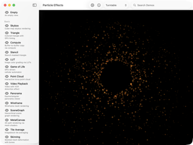](Documentation/screenshots/ParticleEffects.png) |
| **GLTF** | glTF/GLB model loader and viewer | [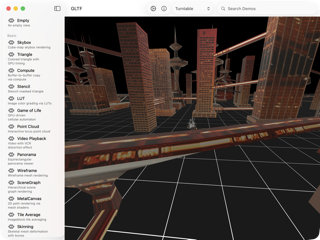](Documentation/screenshots/GLTF.png) |
| **Voxel** | Compute-raymarched voxel volumes | [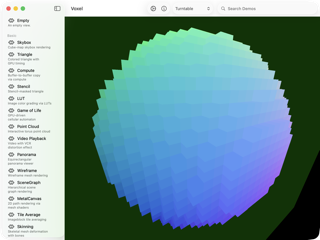](Documentation/screenshots/Voxel.png) |
| **Grass** | Mesh-shader procedural grass | [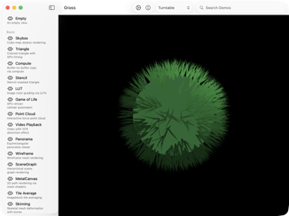](Documentation/screenshots/Grass.png) |
| **Spiral Particles** | Mesh-shader spiral particles | [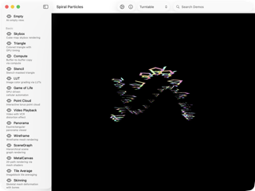](Documentation/screenshots/SpiralParticles.png) |
| **Tiled SDF** | Tile-culled 2D SDF rendering | [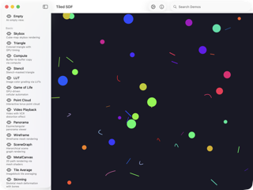](Documentation/screenshots/TiledSDF.png) |
| **Ray Tracing** | Cornell box path tracer | — |
| **Shader Graph** | Build Metal shaders as Swift DSL graphs | — |
| **Phosphor** | Live-compile Metal shader snippets (shadertoy-style) | — |

### In-progress

| Example | Description | Screenshot |
|---------|-------------|------------|
| **Color Adjust** | Compute-based color adjustments | [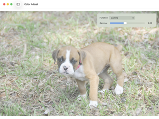](Documentation/screenshots/ColorAdjust.png) |

### Rendering

| Example | Description | Screenshot |
|---------|-------------|------------|
| **Infinite Grid** | An infinite ground plane grid with interactive camera | — |
| **Spinning Cube** | A rotating RGB cube with MSAA controls | — |
| **Shadow Map** | Multi-light shadow mapping with PCF and depth bias controls | — |
| **Ray Traced Shadows** | Hardware-accelerated ray-traced shadows with acceleration structures | — |

### Slug

| Example | Description | Screenshot |
|---------|-------------|------------|
| **Slug Debug** | Basic Slug text rendering test | — |
| **Matrix Rain** | Matrix-style falling text rendered with Slug | — |
| **Spinning Sphere** | Text mapped to a spinning sphere with Slug | — |
| **Text Panel** | Multi-language text rendered with Slug | — |
| **Terminal *(macOS only)*** | Live terminal output rendered with Slug | — |
| **Immersive Matrix Rain *(visionOS only)*** | Matrix rain in immersive visionOS space | — |

### Platform

| Example | Description | Screenshot |
|---------|-------------|------------|
| **Mobile *(iOS only)*** | AR-powered mobile rendering demo | — |
| **VisionOS *(visionOS only)*** | Immersive visionOS stereo rendering | — |
<!-- END:DEMOS -->

## Screenshots

Screenshots and thumbnails live under `Documentation/screenshots/`. The tables above are regenerated from [`Documentation/demos.yaml`](Documentation/demos.yaml); run:

```sh
uv run --with pyyaml Documentation/generate-docs.py --readme
```

to refresh them.

## License

See [LICENSE](LICENSE) for details.
